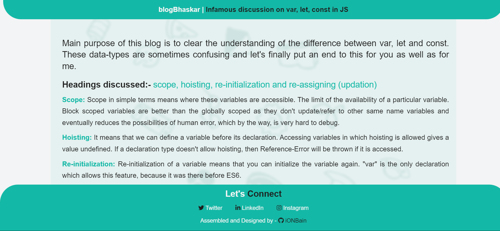

# blogTwo-varLetConst

Not clear what is difference between var, let and const? Check out my second blog which discusses about the declaration types over headings like hoisting, scope, re-initialization and re-assignment of values.
> What's special - I have added infinite background animation, do check it by [clicking here](https://blogtwo-ba.netlify.app/)

* The landing page of my blog is as follows

> Technologies/Libraries used :-
* CSS
* HTML

> Platform used to develop project :-
* [Visual Studio Code](https://code.visualstudio.com/)
> Platform used to host and deploy the project :-
* [Github.com](https://github.com/ionbain)
* [Netlify.com](https://app.netlify.com/teams/bhaskartx/)
